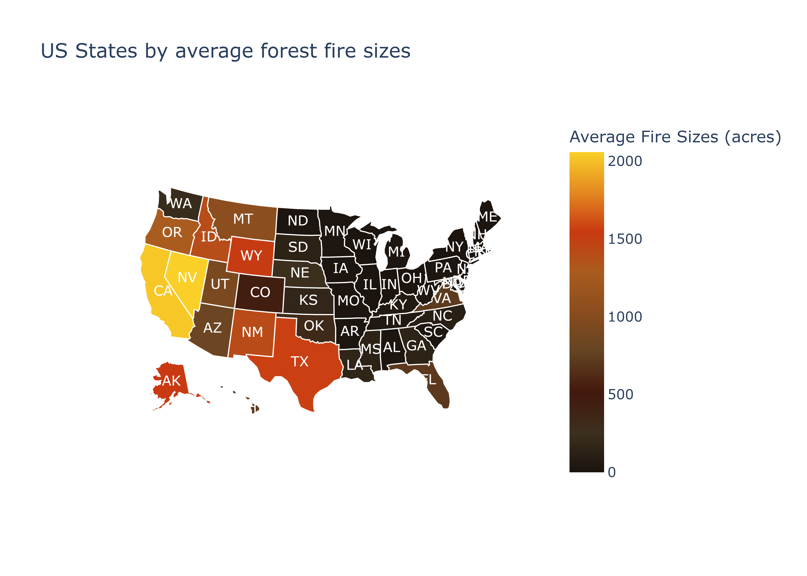
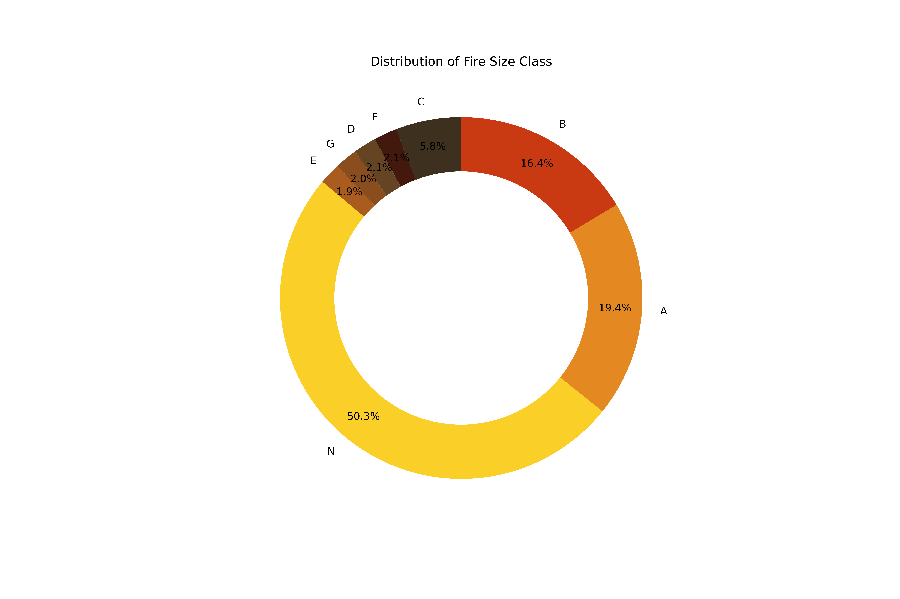

# BLAZE PREDICT: PREDICTIVE MODELlING OF FIRE SIZES USING CLIMATE INDICATORS

This project aims to predict the occurrence and scale of wildfires using a combination of historical wildfire data and various climate indicators. The data spans from 2008-2018 and provides insights into the patterns of wildfires in the US. By integrating multiple data sources and employing advanced machine learning models, we offer a tool that can be instrumental in wildfire preparedness and response strategies.

## Table of Contents

1. [Installation & Prerequisites](#installation--prerequisites)
2. [Project Structure](#project-structure)
3. [Dataset Overview & Preprocessing](#dataset-overview--preprocessing) 
4. [Exploratory Data Analysis (EDA)](#exploratory-data-analysis-eda)
5. [Methodology](#methodology)
6. [Visual Insights](#visual-insights)
7. [Challenges & Limitations](#challenges--limitations)
8. [Conclusion & Future Work](#conclusion--future-work)
9. [References](#references)
10. [Authors](#authors)

## Installation & Prerequisites

### Software Requirements:
- 
- 
### Installation:
Clone the repository and navigate to the project directory. Install the required libraries:
```
pip install pandas numpy seaborn matplotlib sqlite3 sklearn tensorflow meteostat plotly jupyter
```
### Execution Guide
Ensure the installation of all necessary libraries.
- Downlad and extract the database folder [RDS-2013-0009.5_Data_Format4_SQLITE.zip](https://www.fs.usda.gov/rds/archive/products/RDS-2013-0009.5/RDS-2013-0009.5_Data_Format4_SQLITE.zip) to the Datasets folder in Project.
- Initiate with the DataProcessing.ipynb notebook for data extraction and preprocessing.
- Transition to FireAnalysis.ipynb for an exploratory journey.
- Culminate with the Predictive Modelling and Evaluation.ipynb for modeling and evaluation insights.

## Project Structure
- **DataProcessing.ipynb:** This notebook handles the extraction and preprocessing of the forest fire data. The data is sourced from the U.S. Department of Agriculture's FPA_FOD_20210617.sqlite database.
- **FireAnalysis.ipynb:** Contains the exploratory data analysis (EDA) of the forest fire data. Various visualizations and statistics are generated to understand the data better.
- **Predictive Modelling and Evaluation.ipynb:** This notebook contains the predictive models used to forecast the occurrence and size of wildfires. It focuses on the FIRE_SIZE_CLASS variable as the target.
- **Datasets:** A folder to store the datasets used in this project, including the source data and processed data.
- **Plots:** Stores plots and figures generated during the analysis and model evaluation phases.
- **Final Project Poster.pdf:** An academic poster that provides an overview of the project, its objectives, methods, and results.


## Dataset Overview & Preprocessing

The FPA_FOD_20210617.sqlite database is preprocessed and combined with the meteorological data to form the `final_dataset2008-18.csv`. Extensive data cleaning, NA handling, and feature engineering were performed and `model_dataset2008-18.csv` is formed to ensure the quality and reliability of the predictive models.

## Exploratory Data Analysis (EDA)

The dataset was explored to gain insights into fire occurrences, sizes, causes, and their relationship with climatic variables. Descriptive statistics were computed, and visualizations like bar plots, pie charts, and heat maps were used to better understand the data.

## Methodology

Various machine learning models including Logistic Regression, Decision Trees, Deep Neural Networks, and Random Forest were employed. Through iterative experimentation and hyperparameter tuning, we identified models that best predict wildfire occurrences and sizes based on the provided predictors.

## Visual Insights

- **Fire Size by State**: Comparing fire sizes across states.

- **Target Class Distribution**: Representing target variable `FIRE_SIZE_CLASS` distribution in final dataset.


Fire Size Class | A | B | C | D | E | F | G | N 
--- | --- | --- | --- |--- |--- |--- |--- |--- 
Size | 0 to .25 acres | .26 to 9.9 acres | 10.0 to 99.9 acres | 100 to 299 acres| 300 to 999 acres | 1000 to 4999 acres | 5000+ acres | No Fire
 

## Challenges & Limitations

Data size, missing values, computational constraints, and data balance were the primary challenges faced. The large dataset size and computational limitations made it essential to balance model performance with efficiency.

## Conclusion & Future Work

This project demonstrates the potential of predictive modeling in addressing wildfires. While the models provided valuable insights, future work could focus on integrating more data sources like satellite imagery and real-time monitoring systems to further enhance predictive capabilities.

## References
1. [Short, Karen C. 2021. Spatial wildfire occurrence data for the United States, 1992 2018 [FPA_FOD_20210617]. 5th Edition. Fort Collins, CO: Forest Service Research Data Archive.](https://doi.org/10.2737/RDS-2013-0009.5)

2. [Meteostat](https://meteostat.net/en/)

3. G. E. Sakr, I. H. Elhajj, G. Mitri and U. C. Wejinya, "Artificial intelligence for forest fire prediction, 2010 IEEE/ASME International Conference on Advanced Intelligent Mechatronics, 
Montreal, QC, Canada, 2010, pp. 1311-1316, doi: 10.1109/AIM.2010.5695809.

4. R. Laube and H. J. Hamilton, Wildfire Occurrence Prediction Using Time Series Classification: A Comparative Study, 2021 IEEE International Conference on Big Data (Big Data), Orlando, FL, USA, 2021, pp. 4178-4182, doi: 10.1109/BigData52589.2021.9671680.

5. F. Huot, R. L. Hu, N. Goyal, T. Sankar, M. Ihme and Y. F. Chen, "Next Day Wildfire Spread: A Machine Learning Dataset to Predict Wildfire Spreading From Remote-Sensing Data, in IEEE Transactions on Geoscience and Remote Sensing, vol. 60, pp. 1-13, 2022, Art no. 4412513, doi: 10.1109/TGRS.2022.3192974.

6. A. K. Sahoo, S. K. Lenka, and S. K. Nayak, “Predicting Forest Fire Using Remote Sensing Data And Machine Learning, arXiv:2101.01975

7. Predictive modeling of wildfires: A new dataset and machine learning approach .Younes Oulad Sayad a, Hajar Mousannif b, Hassan Al Moatassime;

## Authors
- Rohan Jovi Thevara (22209135)
- Alvin Sebastian (22201493)
